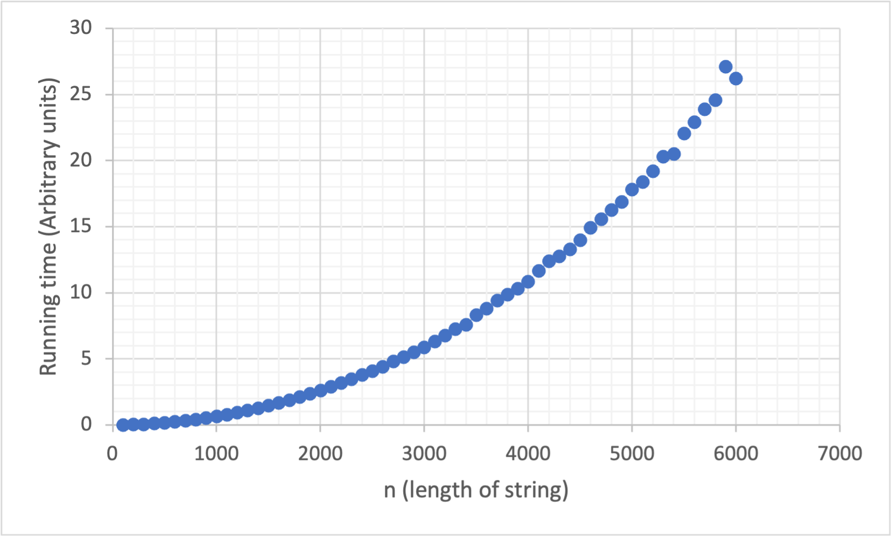
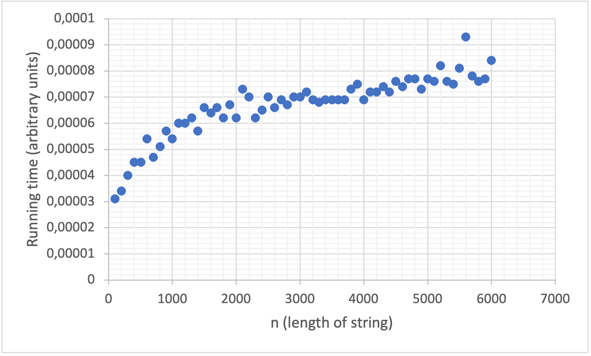

# Project 3: Suffix array construction

You should implement a suffix array construction algorithm. You can choose to implement the naive O(n² log n)-time construction algorithm based on just sorting all the suffixes using a comparison based algorithm, the O(n²) algorithm you get if you radix sort the suffixes, or you can use the suffix tree from project 2: If you run through the suffix tree, and traverse children in lexicographical order, you will see each leaf in lexicographical order as well, and if you collect all the leaf-labels you have your suffix array.

If you feel adventurous, you are also welcome to implement one of the linear time algorithms *skew* or *SAIS* that we will see the next two weeks, but then you will have to read a bit ahead.

Once you have constructed a suffix array you should use it to implement a binary-search based exact pattern matching. Since I haven’t taught you have to do it faster, it should run in O(m log n + z) where m is the length of the pattern, n is the length of the genome string, and z is the number of matches you output. (One of the algorithms you have seen multiplies z by m, but you know how to avoid this).

Implement the suffix array construction and the exact pattern matching in a single program called `sa`.  The program should take the same options as in project 1, so `sa genome.fa reads.fq`. The program should output (almost) the same Simple-SAM file. Because a search in a suffix array is not done from the start to the end of the string the output might be in a different order, but if you sort the output from the previous project and for this program, they should be identical.

## Evaluation

Once you have implemented the `sa` program (and tested it to the best of your abilities) fill out the report below, and notify me that your pull request is ready for review.

# Report

## Algorithm

*Which algorithm did you use to construct the suffix array. What is its running time?*
We implemented two (and a half) versions, a naive version to compare running times with, simply using the builtin sort function and some string slicing. We expect this to run in O(n log n) comparisons, as that is the running time of pythons builtin sort.

Our own implementation is a radix sort, that runs in O(n^2) given that we assume a constant sized alphabet. We handled uneven suffix lengths by simply extending all suffixes with the sentinel character to match the length of the input string. The alphabet used for buckets, is generated by scanning through the string once and sorting the characters. 

The half implementation is an attempt at skew, that we didnt manage to finish in time, but you can have a look and see if it tickles your fancy, viewer discretion is adviced. 

## Insights you may have had while implementing the algorithm
When you finish up writing a bucket sort for the third time in a day, you begin to realize that maybe you should have just made a function for it to begin with, fool me once... 

In general, we should get better at recognizing when supproblems can be boiled down to a standalone function to make the code more readable, turns out having somewhat readable code also helps with debugging, and being anle to trace errors back to specific functions also speeds up that process

## Problems encountered if any
The usual problem with Johan not being able to sync with git, implementing the skew algorithm turned out to be tricky just in general. The biggest problems with skew being, understanding what to do with the results of the recursion, and mapping back and forth correctly. 
There is ofcourse the issue of a the horribly slow radix implementation, but the only ones who suffer from that would be us, when we have to run test, and any soul unfortunate enough to take a look at the code.

## Validation

*How did you validate that the construct and the search algorithm works?*

We once again used Johan's beautiful data generators to generate various strings including repetetive, empty and identical and palindromic.
Compared with the output of the naive pattern matching we implemented in the first project.
We should probably start using the pytest to automate this.

## Running time

*List experiments and results that show that both the construction algorithm and the search algorithm works in the expected running time. Add figures by embedding them here, as you learned how to do in project 1.*

The running time seems to behave as expected. The radix sort implementation of array construction should be O(n^2), and it is when run on data generated from a simple markov model using data_gen.py.

After dividing running times by $n^2$ for each datapoint we get a linear graph increasing with what is assumed to be the number of outputs (z)

For the pattern matching we did a similar experiment using the exact same data and a random string of length 5 as the search pattern. It is expected to run in $O(m*log(n)+z)$. Since we are keeping m constant (5), the curve should be logarithmic. 

To test if the curve is indeed logarithmic the times are divided by $log(n)$.

There is a curve to this graph which we cannot explain. It might have something to do with the outputs (z).
